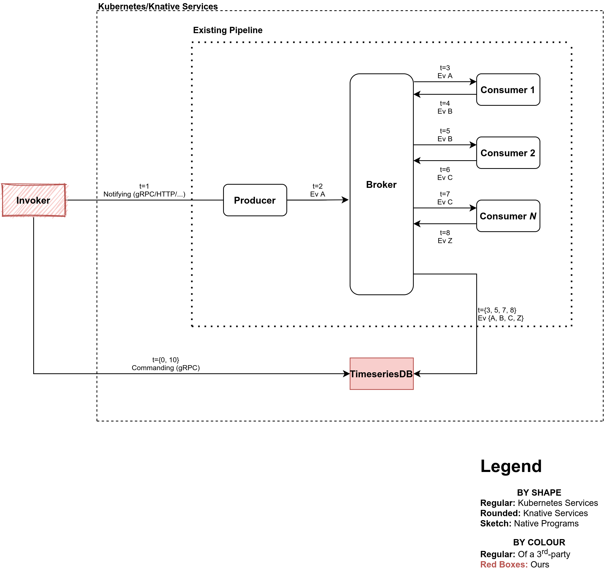

# Benchmarking Methodology
This guide aims to introduce the benchmarking methodology used in
vHive and how to run the benchmarks.

## Introduction
The key points are:
- The invoker ([tools/invoker](/tools/invoker)) steers load to
a collection of serverless benchmarks (also called _workflows_).
- Benchmarks can comprise a single or a collection of functions calling
one another, as well as asynchronous (i.e., eventing) pipelines.
- For synchronous single- and multi-function benchmarks, the invoker measures
the latency end to end.
- For asynchronous benchmarks, the invoker requires a workflow with
a [TimeseriesDB](/tools/benchmarking_eventing) service.
    - For each invocation, the invoker saves a timestamp of the workflow
    being invoked whereas TimeseriesDB waits for the corresponding completion
    events and takes a timestamp when the last completion event is received.
    - See [chained-function-eventing](/benchmarks/chained-function-eventing)
    for an example.
- At the end of an experiment, the invoker collects all records of synchronous benchmarks,
retrieves the records of asynchronous workflows, adding these records to those
for the synchronous benchmarks.

### TimeseriesDB

_Diagram of TimeseriesDB in a sample asynchronous pipeline_

### vHive Metadata
vHive Metadata is some high-level information for a given asynchronous
request that is  relied on by the TimeseriesDB. For the purposes of
pipeline developers, it can simply be thought as an opaque binary
object that is to be passed around in gRPC requests and CloudEvents.
vHive Metadata is created at the invoker, and eventually consumed by
TimeseriesDB.

In gRPC requests, vHive Metadata is passed as field
`bytes vHiveMetadata = 15` of `HelloRequest` message. In CloudEvents,
vHive metadata is stored in `vhivemetadata` extension attribute of type
byte array---this is also what TimeseriesDB looks for.

Developers can use `tools/benchmarking_eventing/vhivemetadata` to read
and create vHive metadata objects.

## Benchmarking
You can use [tools/invoker](/tools/invoker) (the "invoker") to
get the end-to-end latencies of your serving and eventing workflows.

**On any node**, execute the following instructions below **at the root
of vSwarm repository** using **bash**:
1. Build the invoker:
    ```bash
    (cd tools/invoker; go build github.com/ease-lab/vswarm/tools/invoker)
    ```

    - Keep the parenthesis so not to change your working directory.
2. Create your `endpoints.json` file. It is created automatically for
    you if you use [tools/deployer](/tools/deployer) (the
    "deployer"), however eventing workflows are not supported by the
    deployer so the following guide is presented; you may use it for
    manually deployed serving workflows too.

    `endpoints.json` is a serialization of
    **a list of [Endpoint structs](/tools/endpoint/endpoint.go)**
    with the following fields:

    - **`hostname` string** \
        Hostname of the starting point of a workflow/pipeline. Its
        difference from a URL is not containing a port number.

    - **`eventing` bool** \
        True if the workflow uses Knative Eventing and thus its
        duration/latency is to be measured using TimeseriesDB.
        TimeseriesDB must have been deployed and configured correctly! An example can be found in
        [chained-function-eventing μBenchmark](/benchmarks/chained-function-eventing)

    - **`matchers` map[string]string** \
         Only relevant if `eventing` is true, `matchers` is a mapping
         of CloudEvent attribute names and values that are sought in
         completion events to exist.

    **Example:**
    ```json
    [
        // This JSON object is an Endpoint:
        {
            "hostname": "xxx.namespace.192.168.1.240.sslip.io",
            "eventing": true,
            "matchers": {
                "type": "greeting",
                "source": "consumer"
            }
        },
        ...
    ]
    ```
3. Execute the invoker:
    ```bash
    ./tools/invoker/invoker
    ```

    **Command-line Arguments:**
    - **`-rps <integer>`** \
      Targeted requests per second (RPS); default `1`.
    - **`-time <integer>`** \
      Duration of the experiment in seconds; default `5`.
    - **`-endpointsFile <path>`** \
      Path to the endpoints file; default `./endpoints.json`.

### Using docker-compose
One may include a Docker-compose manifest which helps with testing deployment locally without
Knative. All images deployed with Docker-compose will be on the same network so they can
communicate over a shared network, and one can use the names of services as addresses since
they are translated automatically by Docker. Make sure to expose a port so that a client can
communicate with the initial function in the workload. See the
[serving Docker-compose](/benchmarks/chained-function-serving/yamls/docker-compose/docker-compose.yml) for an
example.
